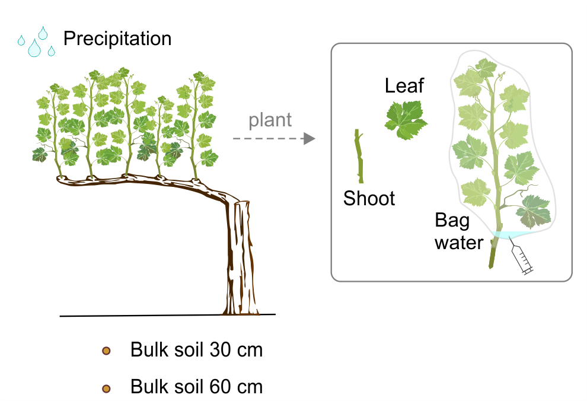
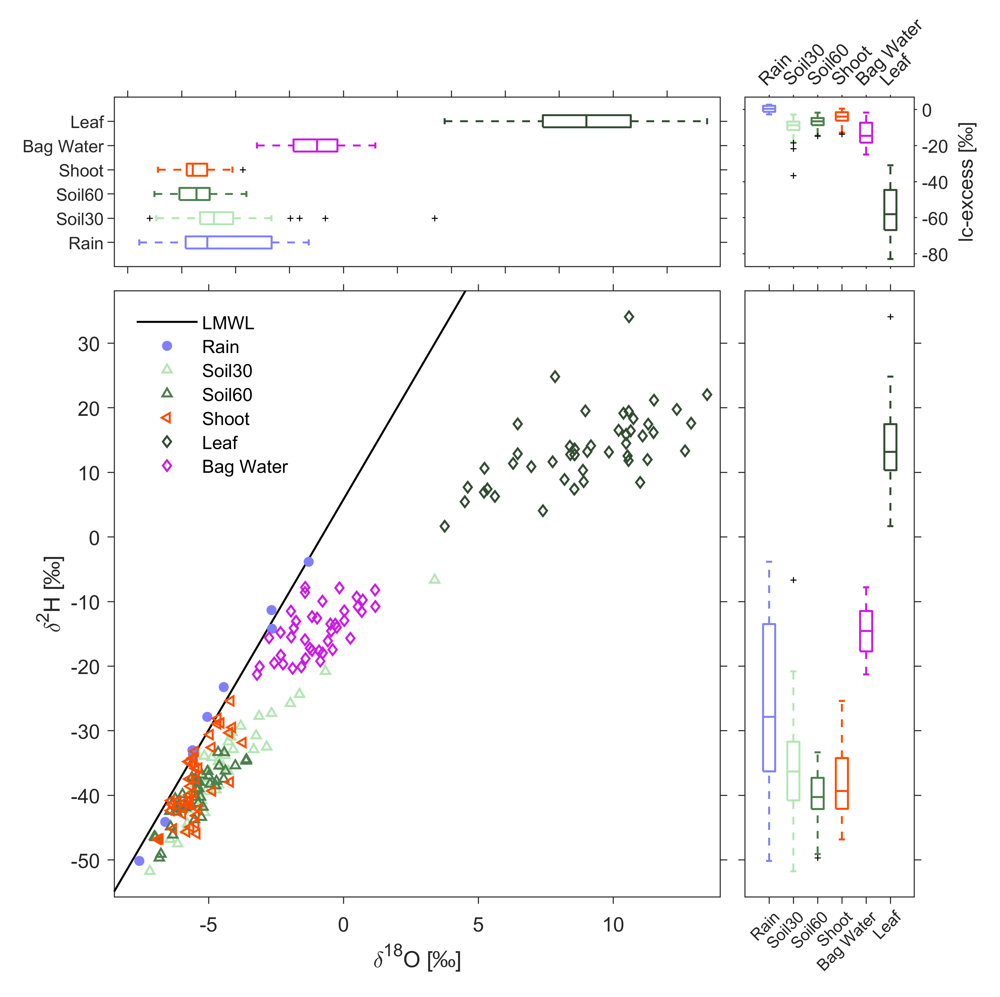

# Montepaldi vineyard data

This dataset includes soil moisture and water stable isotope data collected at the Montepaldi farm (Tuscany, Italy) in the summer 2021. The data is discussed in the paper "*Ecohydrological dynamics and temporal water origin in a European Mediterranean vineyard*", by P. Benettin, M. Tagliavini, C. Andreotti, F.S. Manca di Villahermosa, M. Verdone, A. Dani and D. Penna. The manuscript is currently under peer review. The data has a persistent DOI on Zenodo: [https://doi.org/10.5281/zenodo.12708488](https://doi.org/10.5281/zenodo.12708488)

## Field site

The experimental vineyard *Nincio 3* (43° 40' 14.47" N, 11° 08' 20.46" E, WGS84, [see on Google Maps](https://maps.app.goo.gl/tfqomNEx16TET9An8)), has a size of 2.3 ha and is located on a slope degrading toward a small river. Elevation ranges between 109 and 146 m a.s.l. The vineyard is cultivated with 12-year-old grapevines. 

 

## The Data

The dataset includes 2 main data files: 

### Montepaldi_VWC_20240301.csv

This file includes soil moisture timeseries data collected through FDR probes and aggregated to 15-min resolution. We installed 10 probes in total, at 2 locations (top and bottom of the hillslope) and at 2 depths (30 and 60 cm). 

The file has 2 lines of description on top. Every row in the table corresponds to a date (format 12-Jun-2021 00:00:00). The columns include volumetric water content measurements and the names follow the convention [*location*][*depth*]_[*n*] (for example `top30_1`) where *location* is `top` or `bottom`, *depth* is `30` or `60` and *n* can be up to `3` in case there were up to 3 probes at the same location and depth.

Missing data (due to different installation dates and to the failure of 1 sensor) are indicated as `NaN`.

### Montepaldi_isotopes_20240301.csv

This data table includes the stable isotope analysis of various samples collected at the vineyard, as illustrated below:

Every row in the table refers to a different physical sample. Variables are:

- `sampl_strt`: date when sampling started (format yyyy-mm-dd, as 2021-06-22)
- `sampl_end`: date when sampling ended. It is usually identical to `sampl_strt` except for precipitation samples
- `type`: sample type, i.e. `Soil30`, `Soil60`, `Rain`, `Leaf`, `Shoot`, `Bag Water`,
- `rootstock`: either `1103` or `420A`
- `slope_position`: either `TOP` or `BOT`
- `vine_id`: id (either `1` or `2`) to distinguish different grapevines at the same location and with the same rootstock
- `d2h`: 2H ratio in delta notation (permil with respect to the VMOSW)
- `d18o`: 18O ratio in delta notation (permil with respect to the VMOSW)
- `lc_ex`: lc-excess value with respect to a LMWL: d2H = 7.14 d18O + 5.82

The image below summarises all the isotope data values collected at the site.

## Additional data sources

Meteorological data from the Montespertoli weather station (ID TOS01004915, located 4.5 km away from the experimental vineyard, [see on Google Maps](https://maps.app.goo.gl/sDGXbXdZMLd8vKiy8)) is available from the portal of the Tuscany hydrologic and geologic service ([Settore Idrologico e Geologico Regionale Toscana](https://sir.toscana.it/)) under the section "Dati/Archivio storico".

## LICENSE

This work is licensed under a
[Creative Commons Attribution 4.0 International License][cc-by].

[cc-by]: http://creativecommons.org/licenses/by/4.0/
